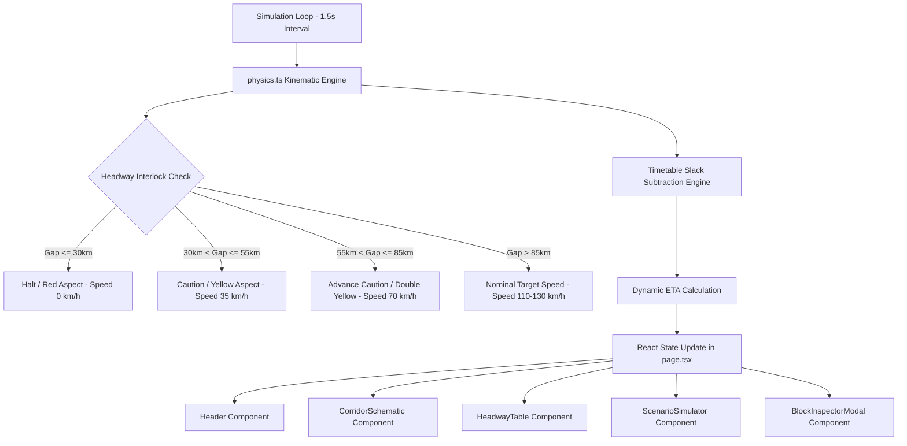

# 🛠️ Tech Stack & Technical Architecture — Trak

This document outlines the software stack, architectural design patterns, physics simulation engine, design system, and technical specifications behind **Trak**.

---

## 💻 Core Technology Stack

| Layer | Technology | Version | Purpose |
| :--- | :--- | :--- | :--- |
| **Framework** | [Next.js](https://nextjs.org/) | `14.2.15` | App Router, SSR layout shell, optimized client-side hydration |
| **UI Library** | [React](https://react.dev/) | `18.3.1` | Component-driven UI architecture, state hooks, effect management |
| **Language** | [TypeScript](https://www.typescriptlang.org/) | `5.6.3` | Strict type definitions across railway domain entities and telemetry |
| **Styling** | [Tailwind CSS](https://tailwindcss.com/) | `3.4.14` | Utility-first styling, custom dark void palette, glassmorphism filters |
| **Animations** | [Framer Motion](https://framer.com/motion) | `11.11.9` | High-fps hardware-accelerated layout transitions & train position sliding |
| **Iconography** | [Lucide React](https://lucide.dev/) | `0.453.0` | Accessible vector telemetry icons |
| **Utilities** | `clsx` & `tailwind-merge` | `2.1.1` / `2.5.4` | Dynamic conditional class merging and conflict resolution |
| **Audio Engine** | Web Audio API | Native Browser API | Zero-asset synthetic audio beacon synthesizer |

---

## 🏗️ System Architecture & Data Flow

---

## ⚡ Physics & Signaling Interlock Engine (`src/lib/physics.ts`)

The simulation engine models high-speed railway kinematics and automatic block signaling logic:

1. **Position Kinematics**:
   $$\text{position}_{t+1} = \text{position}_t \pm \left( \frac{\text{speed} \times \Delta t \times \text{multiplier}}{3600} \right)$$

2. **Headway Distance Separation & Hard Interlocks**:
   - **$\le 30.0\text{ KM}$ Gap**: Mandatory Stop (**RED Aspect**, $0\text{ km/h}$).
   - **$30.0 - 55.0\text{ KM}$ Gap**: Restricted Speed (**YELLOW Aspect**, $35\text{ km/h}$).
   - **$55.0 - 85.0\text{ KM}$ Gap**: Advance Caution (**DOUBLE YELLOW Aspect**, $70\text{ km/h}$).
   - **$> 85.0\text{ KM}$ Gap**: Unrestricted Signal (**GREEN Aspect**, nominal max speed).

3. **Dynamic ETA & Recovery Slack Formula**:
   $$\text{Raw Delay} = \max\left(0, \frac{\text{Distance Remaining}}{\text{Current Speed}} - \text{Scheduled Dwell}\right)$$
   $$\text{Net Displayed Delay} = \max\left(0, \text{Raw Delay} - \text{Recovery Slack Buffer}\right)$$

---

## 🎨 Design System & Visual Aesthetics

- **Color Palette**:
  - `Void BG`: `#06070a` (Deep cosmic dark background)
  - `Card BG`: `#0d0f17` with `backdrop-blur-md`
  - `Border Zinc`: `#1f2433`
  - `Cyan Accent`: `#06b6d4` (Primary telemetry glow)
  - `Emerald Accent`: `#10b981` (Nominal / Clear states)
  - `Amber Accent`: `#f59e0b` (Caution / Warning states)
  - `Rose Accent`: `#f43f5e` (Red aspect / Interlock halt)
- **Typography**: `JetBrains Mono` / `Framer Mono` font stacks for numerical alignment (`font-mono-numbers`).

---

## 🔊 Audio Engine Architecture (`src/lib/audio.ts`)

Instead of relying on heavy external `.mp3` / `.wav` assets, **Trak** uses a custom Web Audio API synthesizer:
- **Click Beacons**: Short sine wave pulse ($800\text{ Hz} \to 400\text{ Hz}$).
- **Signal Fault Alerts**: Dual-tone square wave warning siren.
- **Speed Override Tone**: Sawtooth ramp tone for locomotive speed adjustment.

---

## 🚀 Performance Optimizations

1. **Zero External Media Assets**: All UI icons, track beds, train silhouettes, and audio cues are generated dynamically via SVG path calculations and Web Audio synthesis.
2. **GPU-Accelerated CSS & Framer Motion**: Train position movement uses `transform: translate3d` and Framer Motion layout hardware acceleration.
3. **Decoupled Cursor Glow Follower**: Cursor glow positioning runs outside React re-render cycles using direct CSS transform updates and smooth idle fade-out decay timers.
